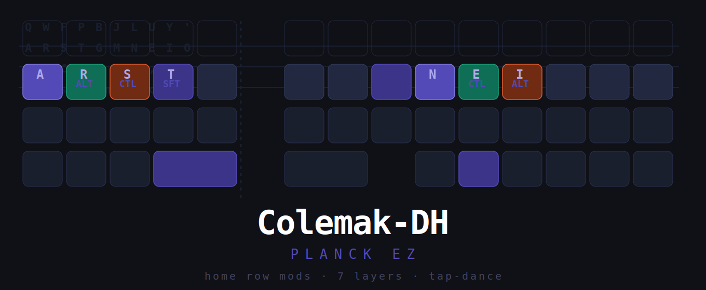
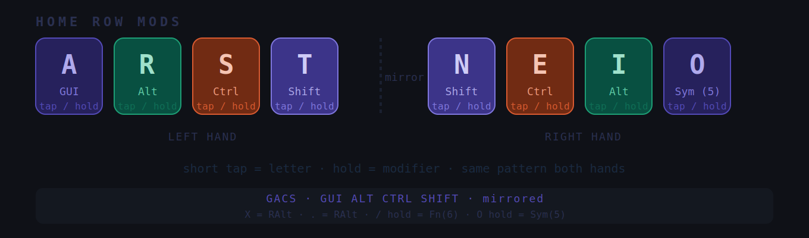
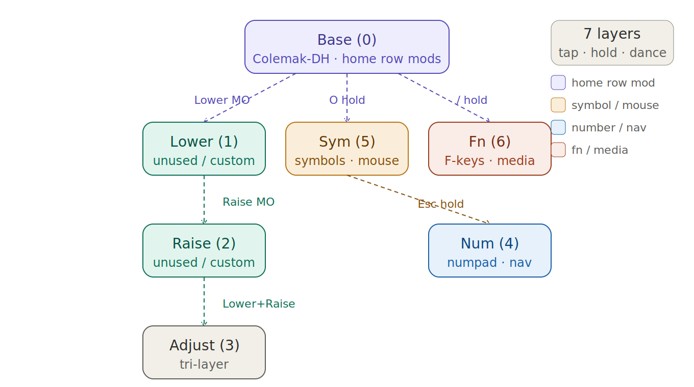

# 🌌 Voidwalker Planck



## 📋 Overview
This repository contains the high-performance, version-controlled firmware for my **Planck EZ**. Optimized for **macOS (M4 Apple Silicon)** and a terminal-first workflow, this layout prioritizes ergonomic efficiency and minimal hand movement.

---

## 🛠️ Key Architectural Pillars

### 1. Colemak-DH Home Row Mods (GACS)
I utilize a mirrored **GACS (GUI, Alt, Ctrl, Shift)** Home Row Mod paradigm. This allows for complex system-level modifiers without leaving the home row, drastically reducing RSI risk and increasing speed.



* **Left Hand**: A (GUI), R (Alt), S (Ctrl), T (Shift).
* **Right Hand**: N (Shift), E (Ctrl), I (Alt), O (GUI).
* **Alt Gr**: Mapped to `X` and `.` for extended character access.

### 2. Multi-Layer Logic (7 Layers)
The layout is organized into 7 distinct layers, navigated via tap-dance and momentary toggles.



* **_BASE (0)**: Colemak-DH for pure alphanumeric entry.
* **_NUM (4)**: Numpad and navigation (Arrows, Home, End, PgUp/Dn).
* **_SYM (5)**: Advanced symbols and **Mouse Emulation** (Mouse Up/Down, Clicks, Scroll).
* **_FN (6)**: F-keys (F1-F12), Media controls, and System requests.

### 3. Tap-Hold & Thumb Cluster Utility
* **`WIN_NUM`**: Tap for **Command (GUI)**, Hold for **Num (4)** layer.
* **`FN_HLD`**: Tap for **Escape**, Hold for **Fn (6)** layer.
* **`SYM_HLD`**: Dedicated hold on the `/` key for the **Sym (5)** layer.

---

## 🚀 Installation & Compilation

1. **Environment Setup**: Ensure `qmk` CLI is installed and configured for macOS.
2. **Compile**:
   ```bash
   qmk compile -kb planck/ez -km mac_colemak
3. Flash: Use Keymapp to flash the resulting .bin file to the Planck EZ.
